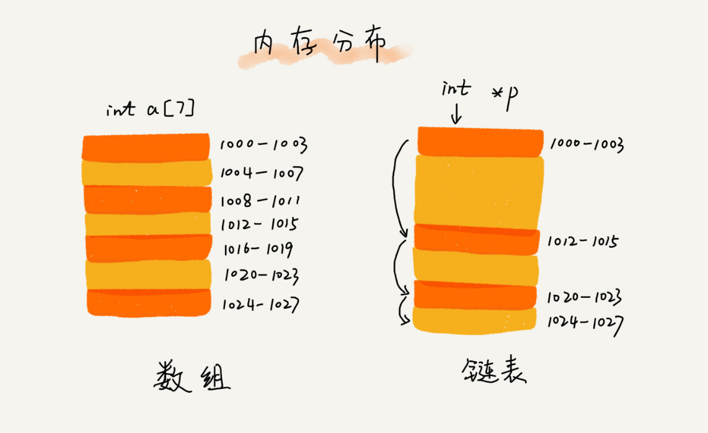

[toc]

# 数组

> 数组(Array)是一种**线性表**数据结构.它用一组**连续的内存空间**,来存储一组具有**相同类型的数据**.

定义中有几个关键字需要特意讲解一下

1. **线性表**(Linear List).线性表就是数据排成像一条线一样的结构.每个线性表上的数据最多只有前和后两个方向.数组/链表/队列/栈都是线性表结构.


相反的对立面便是**非线性表**,如二叉树/堆/图等.非线性表中,数据之间并不是简单的前后关系.


2. **连续的内存空间和相同的数据**.因为这两个限制,数组有了==随机访问==的特性.有利有弊,两个限制让数组在删除/插入数据的操作时要做大量的数据搬移工作.

## 低效的"插入"和"删除"
>  为保持数据连续性,插入/删除操作会变得相对低效.
### 插入

在一个长度为n的数组中.我们需要在k位置插入一个数据.此时我们需要将k~n位置的元素全都往后移一个位置.

时间复杂度的计算:如果在数组末尾插入数据不需移动其他数据,此时时间复杂度为O(1);如果在数组的开头插入,那么所有的数据都需要往后移动一位,最坏时间复杂度为O(n).因我们在每个位置插入元素的概率一致,所以平均情况时间复杂度为(1+2+...n)/n=O(n).

如果必须保持数据的有序,则必须按照上述方法进行插入操作.但是,如果数组中的数据没有规律,则可以将k位置的数据移至最后,将新的数据填入k位置即可.


### 删除

与插入相似,如要删除k位置的数据,为了内存连续性,需要将后续的数据向前搬移一格,否则内存不连续.

时间复杂度上来说,也与插入一致,最好的情况是O(1),最坏的情况是O(n),平均情况O(n).

实际上,在某些特殊情况下,我们并不一定非得要求数组的连续性,可以使用标记删除法,每次删除只进行标记哪些数据是真正需要删除的.等到没有足够多的空间时再进行真正的删除操作,可以大大的减少数据搬移的操作.

# 链表

> 缓存淘汰三大策略:先进先出策略FIFO(First In,First Out)/最少使用策略(Least Frequently Used)/最近最少使用策略LRU(Least Recently Used).

因为数组需要**连续的内存空间**,如果我们需要申请一个100MB大小的数组,当内存中没有连续的足够大的存储空间时,即便内存的剩余总可用大于100MB,任然回申请失败.

链表则相反,它通过"指针"将一组**零散的内存块**串联起来使用,所以如果我们申请的时100MB的链表,则不会有任何问题.



链表有三种常见的结构:单链表/双向链表/循环链表

## 单链表

> 链表通过指针将一组林散的内存块串联在一起.我们把内存块成为链表的"**结点**".为了将所有的节点串起来,每个链表的结点还需要记录链上的下一个结点的地址(**后继指针next**).


两个特殊的结点:

- 头结点:第一个结点,用来记录链表的基地址.
- 尾结点:最后一个结点,下一个结点指向空地址null.

### 链表的查找/插入/删除

数组中的插入与删除为了内存的连续性,需要做大量的数据搬移,所以时间复杂度是O(n),链表本身的数据结构就是内存不连续的,因此没有这个烦恼.


## 循环列表

==循环链表是一种特殊的单向链表==.只是将尾结点的指针指向头结点.当要处理的数据具有唤醒结构特点时,就特别适合采用循环链表.


## 双向链表

单向链表只有一个方向,而双向链表增加了一个前向指针,指向前一个结点.


# 栈

> 后进先出,先进后出即为栈(实例:平时放盘子,从下往上一个一个放;取得时候,我们也是从上往下一个一个一次取,不能从中间任意抽出)


从操作特性上来看,**栈是一种"操作受限"的线性表**,只允许一端的插入和删除数据.

如果使用数组实现栈则称为**顺序栈**,如果使用链表实现栈则称为**链式栈**.

一下为java代码实现的简易顺序栈.

```java
// 基于数组实现的顺序栈
public class ArrayStack {
    private String[] items; // 数组
    private int count;		// 栈中元素个数
    private int size;			// 栈的大小
    
    // 初始化数组,申请一个大小为n的数组空间
    public ArrayStack(int size) {
        this.items = new String[size];
        this.size = size;
        this.count = 0;
    }
    
    // 入栈操作
    public boolean push(String item) {
        if(count == n) return false;//空间不够入栈失败
		items[count] = item;
        ++count;
        return true;
    }
    
    // 出栈操作
    public String pop() {
        if(count == 0) return null;
        --count;
        return item[count+1];
    }
}
```

入栈出栈过程中,只需要一两个临时变量存储空间,所以空间复杂度是O(1).注意,==空间复杂度并非此处需要大小为n的数组即为O(n).二十指出了原本的数据存储空间外,算法运行还需要额外的存储空间.==

时间复杂度,不管是顺序栈还是链式栈,入栈/出栈只涉及栈顶个别数据的操作,所以时间复杂度都是O(1).

# 队列

> 先进先出为队列(实例:排队买票,先来的先买)

栈只支持两个基本操作:入栈push和出栈pop,而队列与栈相似也只支持两个基本操作:入队enqueue(从队列尾部放入数据)出队dequeue(从队列头部取出一个元素)


所以队列与栈一样,也是一种操作受限的线性表数据结构.

## 顺序队列和链式队列

数组实现为**顺序队列**,链表实现为**链式队列**

```java
public class ArrayQueue {
    // 数组:items,数组大小:n
    private String[] items;
    private int n = 0;
    // head表示队头下标,tail表示队尾下标
    private int head = 0;
    private int tail = 0;
    
    // 申请一个大小为capacity大小的数组
    public ArrayQueue(int capacity) {
        items = new String[capacity];
        n = capacity;
    }
    
    // 入队
    public boolean enqueue(String item) {
        if(tail == n) return false;
        items[tail] = item;
        ++tail;
        return true;
    }
    
    // 出队
    public String dequeue() {
        if (tail == head) return null;
        ++head;
        return items[tail];
    }
}
```

相对于栈只需一个**栈顶指针**.队列需要两个指针,一个head指针指向队头,一个tail指针,指向队尾.

# 排序

## 排序算法的执行效率

1. 最好情况/最坏情况/平均情况时间复杂度

   需要分析出最好/最坏时间复杂度对应的排序的原始数据是什么样的;为什么要区分三种时间复杂度?

   1. 部分排序算法需要区分,为好对比,都做区分;

   2. 对于需要排序的数据,有的接近无序,有的完全无需.有序度不同的数据,对于排序的执行时间有影响,需要知道算法再不同数据下的性能表现.

2. 时间复杂度的系数/常熟/低阶

3. 比较次数和交换(或移动)次数

   1. ==排序算法的内存消耗==;原地排序,特指空间复杂度时O(1)的排序算法
   2. ==排序算法的稳定性==;指待排序的序列中存在相等的元素,经过排序之后,相等元素之间原有的先后顺序不变

## 冒泡(Bubble Sort)

> 冒泡只会操作相邻的两个数据.每次冒泡操作都会对相邻的两个元素进行比较,看是否满足大小关系要求.如果不满足就让它俩互换.一次冒泡会让至少一个元素移动到它应该在的位置,重复n次,就完成了n歌数据的排序工作.


上述的冒泡排序还存在优化空间,当某次冒泡已经没有数据交换时,就已经达到完全有序的状态,不用再继续执行后续的冒泡操作.

```java
// 冒泡排序,a表示数组,n表示数组大小
public void bubbleSort(int[] a, int n) {
    if (n <= 1) return;
    
    for(int i = 0; i < n; i++) {
        // 提前退出冒泡循环的标志
		boolean flag = false;
        for(int j = 0;j < n - 1 - i; j++) {
            if(a[j] > a[j + 1]) {// 交换
                flag = true;// 表示有数据交换
                int tmp = a[j];
                a[j] = a[j + 1];
                a[j + 1] = tmp;
            }
        }
        if (!flag) break;
    }
}
```

冒泡排序只设计响铃数据的交换操作,空间复杂度为O(1),是一个原地排序算法;在冒泡排序中,只有交换才可以改变两个元素的前后顺序,在比较时两个元素大小相等不做交换,因此是一个稳定的排序算法.时间复杂度最好情况O(n),最坏情况O(n^2),平均也是O(n^2).

## 插入(Insertion Sort)

> 将数组分为**已排序区间**和**未排序区间**.处室已排序区间只有一个,为数组第一个元素;==核心思想:取未排序区间中的元素,在已排序区间中找到合适的插入位置将其插入,并保证已排序区间数据一直有序.==直至未排序区间中元素为空,算法结束.

```java
public void insertionSort(int[] nums) {
    if (nums.length <= 1) return;
    
    for (int i = 1;i < nums.length;i++) {
        int value = nums[i];
        int j = i - 1;
        while (j >= 0) {
            if (a[j] > value) {
                a[j + 1] = a[j];
            } else {
                break;
            }
            j--;
        }
        a[j + 1] = value;
    }
}
```

插入排序:是原地排序算法,是稳定排序算法,最好O(n),最坏O(n^2),平均O(n^2).

# 选择排序

> 类似插入排序,分已排序区间和未排序区间.选择排序每次从未排序区间中找到最小的元素,将其放到已排序区间的末尾.

